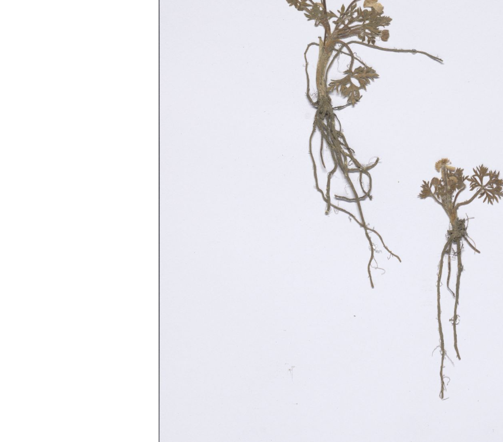

## Brushstrokes of Beauty: Masterpieces from the Alte Nationalgalerie, Berlin

## Part of the series: Baroque TOC

[Programme instructions](https://nfdi4culture.github.io/class-ADA-CP-pipeline/)

2023-07-07 v1.0

A herbarium specimen of Ranunculus seguieri Vill. collected by Stein,B.. https://www.jacq.org/detail.php?ID=1806941 This work is licensed under a Creative Commons Attribution-NonCommercial-ShareAlike 4.0 International License. 

Example publications:

- [Exhibition catalogue demo: toc Baroque /toc](https://nfdi4culture.github.io/experimental-books-workshop/) from Experimental Books – Re-imagining Scholarly Publishing, COPIM. Workshop URL: https://experimentalbooks.pubpub.org/programme-overview

- [Publishers catalogue demo: ScholarLed](https://simonxix.github.io/scholarled_catalogue/) A catalogue of ScholarLed presses built on a Quarto / Jupyter Notebook model for computational publishing. The publication is automatically updated daily to reflect any new books added by the publishers.

- [Proof of concept #1](https://nfdi4culture.github.io/cp4c/) - Computational Publication: Computational Publishing for Collections - ADA CP Prototype #1 - Nov 22

- [Proof of concept #2](https://nfdi4culture.github.io/art_catalogue_test/) - To be confirmed, completion for end of April 2023. This contains all parts fully rendered: Cover, colophon, essay, collection, graph, TIB AV Portal, Semantic Kompakkt

- semanticClimate: To be confirmed - customised research papers readers made for regional climate change action plans based on IPCC reports and sourcing content from open research repositories.

- FSCI Summer School - publishing from collections class: To be confirmed, July 2023

 This work is licensed under a <a rel="license" href="http://creativecommons.org/licenses/by-sa/4.0/">Creative Commons Attribution-ShareAlike 4.0 International License</a>.

Book cover: Digitized herbarium specimens [Pedicularis sudetica Willd.](https://commons.wikimedia.org/wiki/File:In_the_Conservatory_-_edited.jpg#/media/File:In_the_Conservatory_-_edited.jpg). This work is licensed under a Creative Commons Attribution-NonCommercial-ShareAlike 4.0 International License.

## Quarto and Jupyter Notebook

The main publishing workflow uses Quarto to render the output of Jupyter Notebook files. Run the .ipynb files in JupyterLab or Visual Studio Code or any other Jupyter environment and then run:

`quarto render`

for Quarto to render the output into an output directory, in this case, ./docs. 

GitHub Pages then serves the HTML files in the ./docs directory as a website. 
